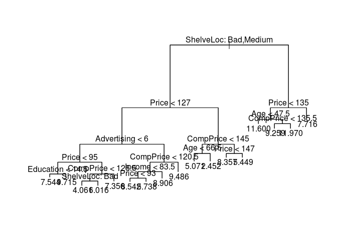
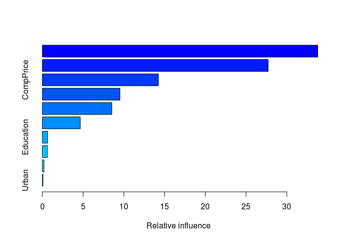
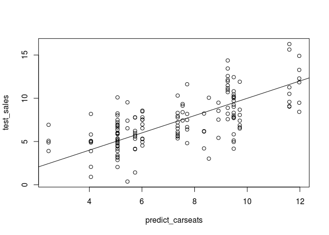
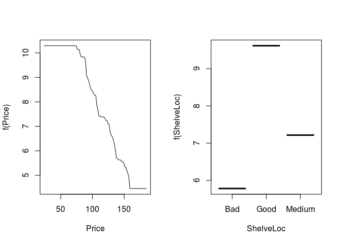

Homework 4: Bags, Forests, Boosts, oh my
================
Komal Suchak
3/9/2019

Problem 1
---------

Problem 7 from Chapter 8 in the text. To be specific, please use a sequence of `ntree` from 25 to 500 in steps of 25 and `mtry` from 3 to 9 for by 1.

In the lab, we applied random forests to the Boston data using mtry=6 and using ntree=25 and ntree=500. Create a plot displaying the test error resulting from random forests on this data set for a more comprehensive range of values for mtry and ntree. You can model your plot after Figure 8.10. Describe the results obtained.

Answer 1
--------

``` r
set.seed(1234)

for (k in 1:20){
  inTraining <- createDataPartition(Boston$medv, p = .75, list = F)
  train_boston <- Boston[inTraining, ]
  test_boston <- Boston[-inTraining, ]
  mtry <- c(3:9)
  ntree <- seq(25, 500, len = 20)
  results <- tibble(trial = rep(NA, 140),
  mtry = rep(NA, 140),
  ntree = rep(NA, 140),
  mse = rep(NA, 140)) 
  for(i in 1:7){
    cat(sprintf('Trial: %s, mtry: %s --- %s\n', k, mtry[i], Sys.time()))
    for(j in 1:20){ 
      rf_train <- randomForest(medv ~ .,
                               data = train_boston,
                               mtry = mtry[i],
                               ntree = ntree[j])
      mse <- mean((predict(rf_train, newdata = test_boston) - test_boston$medv)^2)
      results[(i-1)*20 + j, ] <- c(k, mtry[i], ntree[j], mse)
    }
  }
  if(exists("results_total")){
  results_total <- bind_rows(results_total, results)
  }
  else(
  results_total <- results
  )
}
```

    ## Trial: 1, mtry: 3 --- 2019-03-10 03:27:38
    ## Trial: 1, mtry: 4 --- 2019-03-10 03:27:44
    ## Trial: 1, mtry: 5 --- 2019-03-10 03:27:49
    ## Trial: 1, mtry: 6 --- 2019-03-10 03:27:56
    ## Trial: 1, mtry: 7 --- 2019-03-10 03:28:03
    ## Trial: 1, mtry: 8 --- 2019-03-10 03:28:12
    ## Trial: 1, mtry: 9 --- 2019-03-10 03:28:21
    ## Trial: 2, mtry: 3 --- 2019-03-10 03:28:32
    ## Trial: 2, mtry: 4 --- 2019-03-10 03:28:36
    ## Trial: 2, mtry: 5 --- 2019-03-10 03:28:42
    ## Trial: 2, mtry: 6 --- 2019-03-10 03:28:48
    ## Trial: 2, mtry: 7 --- 2019-03-10 03:28:56
    ## Trial: 2, mtry: 8 --- 2019-03-10 03:29:05
    ## Trial: 2, mtry: 9 --- 2019-03-10 03:29:14
    ## Trial: 3, mtry: 3 --- 2019-03-10 03:29:24
    ## Trial: 3, mtry: 4 --- 2019-03-10 03:29:29
    ## Trial: 3, mtry: 5 --- 2019-03-10 03:29:35
    ## Trial: 3, mtry: 6 --- 2019-03-10 03:29:41
    ## Trial: 3, mtry: 7 --- 2019-03-10 03:29:49
    ## Trial: 3, mtry: 8 --- 2019-03-10 03:29:57
    ## Trial: 3, mtry: 9 --- 2019-03-10 03:30:06
    ## Trial: 4, mtry: 3 --- 2019-03-10 03:30:17
    ## Trial: 4, mtry: 4 --- 2019-03-10 03:30:21
    ## Trial: 4, mtry: 5 --- 2019-03-10 03:30:27
    ## Trial: 4, mtry: 6 --- 2019-03-10 03:30:34
    ## Trial: 4, mtry: 7 --- 2019-03-10 03:30:42
    ## Trial: 4, mtry: 8 --- 2019-03-10 03:30:50
    ## Trial: 4, mtry: 9 --- 2019-03-10 03:31:00
    ## Trial: 5, mtry: 3 --- 2019-03-10 03:31:10
    ## Trial: 5, mtry: 4 --- 2019-03-10 03:31:15
    ## Trial: 5, mtry: 5 --- 2019-03-10 03:31:20
    ## Trial: 5, mtry: 6 --- 2019-03-10 03:31:27
    ## Trial: 5, mtry: 7 --- 2019-03-10 03:31:34
    ## Trial: 5, mtry: 8 --- 2019-03-10 03:31:43
    ## Trial: 5, mtry: 9 --- 2019-03-10 03:31:52
    ## Trial: 6, mtry: 3 --- 2019-03-10 03:32:02
    ## Trial: 6, mtry: 4 --- 2019-03-10 03:32:07
    ## Trial: 6, mtry: 5 --- 2019-03-10 03:32:13
    ## Trial: 6, mtry: 6 --- 2019-03-10 03:32:19
    ## Trial: 6, mtry: 7 --- 2019-03-10 03:32:27
    ## Trial: 6, mtry: 8 --- 2019-03-10 03:32:36
    ## Trial: 6, mtry: 9 --- 2019-03-10 03:32:45
    ## Trial: 7, mtry: 3 --- 2019-03-10 03:32:55
    ## Trial: 7, mtry: 4 --- 2019-03-10 03:33:00
    ## Trial: 7, mtry: 5 --- 2019-03-10 03:33:05
    ## Trial: 7, mtry: 6 --- 2019-03-10 03:33:12
    ## Trial: 7, mtry: 7 --- 2019-03-10 03:33:19
    ## Trial: 7, mtry: 8 --- 2019-03-10 03:33:27
    ## Trial: 7, mtry: 9 --- 2019-03-10 03:33:37
    ## Trial: 8, mtry: 3 --- 2019-03-10 03:33:47
    ## Trial: 8, mtry: 4 --- 2019-03-10 03:33:52
    ## Trial: 8, mtry: 5 --- 2019-03-10 03:33:57
    ## Trial: 8, mtry: 6 --- 2019-03-10 03:34:04
    ## Trial: 8, mtry: 7 --- 2019-03-10 03:34:11
    ## Trial: 8, mtry: 8 --- 2019-03-10 03:34:19
    ## Trial: 8, mtry: 9 --- 2019-03-10 03:34:29
    ## Trial: 9, mtry: 3 --- 2019-03-10 03:34:39
    ## Trial: 9, mtry: 4 --- 2019-03-10 03:34:43
    ## Trial: 9, mtry: 5 --- 2019-03-10 03:34:49
    ## Trial: 9, mtry: 6 --- 2019-03-10 03:34:55
    ## Trial: 9, mtry: 7 --- 2019-03-10 03:35:03
    ## Trial: 9, mtry: 8 --- 2019-03-10 03:35:11
    ## Trial: 9, mtry: 9 --- 2019-03-10 03:35:20
    ## Trial: 10, mtry: 3 --- 2019-03-10 03:35:30
    ## Trial: 10, mtry: 4 --- 2019-03-10 03:35:35
    ## Trial: 10, mtry: 5 --- 2019-03-10 03:35:40
    ## Trial: 10, mtry: 6 --- 2019-03-10 03:35:47
    ## Trial: 10, mtry: 7 --- 2019-03-10 03:35:54
    ## Trial: 10, mtry: 8 --- 2019-03-10 03:36:03
    ## Trial: 10, mtry: 9 --- 2019-03-10 03:36:12
    ## Trial: 11, mtry: 3 --- 2019-03-10 03:36:22
    ## Trial: 11, mtry: 4 --- 2019-03-10 03:36:27
    ## Trial: 11, mtry: 5 --- 2019-03-10 03:36:33
    ## Trial: 11, mtry: 6 --- 2019-03-10 03:36:39
    ## Trial: 11, mtry: 7 --- 2019-03-10 03:36:47
    ## Trial: 11, mtry: 8 --- 2019-03-10 03:36:56
    ## Trial: 11, mtry: 9 --- 2019-03-10 03:37:05
    ## Trial: 12, mtry: 3 --- 2019-03-10 03:37:15
    ## Trial: 12, mtry: 4 --- 2019-03-10 03:37:20
    ## Trial: 12, mtry: 5 --- 2019-03-10 03:37:26
    ## Trial: 12, mtry: 6 --- 2019-03-10 03:37:32
    ## Trial: 12, mtry: 7 --- 2019-03-10 03:37:40
    ## Trial: 12, mtry: 8 --- 2019-03-10 03:37:48
    ## Trial: 12, mtry: 9 --- 2019-03-10 03:37:57
    ## Trial: 13, mtry: 3 --- 2019-03-10 03:38:08
    ## Trial: 13, mtry: 4 --- 2019-03-10 03:38:13
    ## Trial: 13, mtry: 5 --- 2019-03-10 03:38:18
    ## Trial: 13, mtry: 6 --- 2019-03-10 03:38:25
    ## Trial: 13, mtry: 7 --- 2019-03-10 03:38:32
    ## Trial: 13, mtry: 8 --- 2019-03-10 03:38:41
    ## Trial: 13, mtry: 9 --- 2019-03-10 03:38:51
    ## Trial: 14, mtry: 3 --- 2019-03-10 03:39:01
    ## Trial: 14, mtry: 4 --- 2019-03-10 03:39:05
    ## Trial: 14, mtry: 5 --- 2019-03-10 03:39:11
    ## Trial: 14, mtry: 6 --- 2019-03-10 03:39:17
    ## Trial: 14, mtry: 7 --- 2019-03-10 03:39:25
    ## Trial: 14, mtry: 8 --- 2019-03-10 03:39:33
    ## Trial: 14, mtry: 9 --- 2019-03-10 03:39:42
    ## Trial: 15, mtry: 3 --- 2019-03-10 03:39:52
    ## Trial: 15, mtry: 4 --- 2019-03-10 03:39:57
    ## Trial: 15, mtry: 5 --- 2019-03-10 03:40:02
    ## Trial: 15, mtry: 6 --- 2019-03-10 03:40:09
    ## Trial: 15, mtry: 7 --- 2019-03-10 03:40:16
    ## Trial: 15, mtry: 8 --- 2019-03-10 03:40:24
    ## Trial: 15, mtry: 9 --- 2019-03-10 03:40:34
    ## Trial: 16, mtry: 3 --- 2019-03-10 03:40:44
    ## Trial: 16, mtry: 4 --- 2019-03-10 03:40:48
    ## Trial: 16, mtry: 5 --- 2019-03-10 03:40:54
    ## Trial: 16, mtry: 6 --- 2019-03-10 03:41:01
    ## Trial: 16, mtry: 7 --- 2019-03-10 03:41:08
    ## Trial: 16, mtry: 8 --- 2019-03-10 03:41:16
    ## Trial: 16, mtry: 9 --- 2019-03-10 03:41:26
    ## Trial: 17, mtry: 3 --- 2019-03-10 03:41:36
    ## Trial: 17, mtry: 4 --- 2019-03-10 03:41:41
    ## Trial: 17, mtry: 5 --- 2019-03-10 03:41:46
    ## Trial: 17, mtry: 6 --- 2019-03-10 03:41:52
    ## Trial: 17, mtry: 7 --- 2019-03-10 03:42:00
    ## Trial: 17, mtry: 8 --- 2019-03-10 03:42:08
    ## Trial: 17, mtry: 9 --- 2019-03-10 03:42:17
    ## Trial: 18, mtry: 3 --- 2019-03-10 03:42:28
    ## Trial: 18, mtry: 4 --- 2019-03-10 03:42:32
    ## Trial: 18, mtry: 5 --- 2019-03-10 03:42:38
    ## Trial: 18, mtry: 6 --- 2019-03-10 03:42:44
    ## Trial: 18, mtry: 7 --- 2019-03-10 03:42:52
    ## Trial: 18, mtry: 8 --- 2019-03-10 03:43:00
    ## Trial: 18, mtry: 9 --- 2019-03-10 03:43:09
    ## Trial: 19, mtry: 3 --- 2019-03-10 03:43:20
    ## Trial: 19, mtry: 4 --- 2019-03-10 03:43:24
    ## Trial: 19, mtry: 5 --- 2019-03-10 03:43:30
    ## Trial: 19, mtry: 6 --- 2019-03-10 03:43:36
    ## Trial: 19, mtry: 7 --- 2019-03-10 03:43:44
    ## Trial: 19, mtry: 8 --- 2019-03-10 03:43:52
    ## Trial: 19, mtry: 9 --- 2019-03-10 03:44:01
    ## Trial: 20, mtry: 3 --- 2019-03-10 03:44:11
    ## Trial: 20, mtry: 4 --- 2019-03-10 03:44:16
    ## Trial: 20, mtry: 5 --- 2019-03-10 03:44:21
    ## Trial: 20, mtry: 6 --- 2019-03-10 03:44:28
    ## Trial: 20, mtry: 7 --- 2019-03-10 03:44:35
    ## Trial: 20, mtry: 8 --- 2019-03-10 03:44:44
    ## Trial: 20, mtry: 9 --- 2019-03-10 03:44:53

Problem 2
---------

Problem 8 from Chapter 8 in the text. Set your seed with 9823 and split into train/test using 50% of your data in each split. In addition to parts (a) - (e), do the following:

1.  Fit a gradient-boosted tree to the training data and report the estimated test MSE.
2.  Fit a multiple regression model to the training data and report the estimated test MSE
3.  Summarize your results.

Answer 2
--------

#### Part a

``` r
set.seed(9823)
train <- sample(1:nrow(Carseats), nrow(Carseats), nrow(Carseats)/2)
train_carseats <- Carseats[train, ]
test_carseats <- Carseats[-train, ]
```

#### Part b

``` r
#Regression Tree
carseats_tree <- tree(Sales ~ ., data = train_carseats)
summary(carseats_tree)
```

    ## 
    ## Regression tree:
    ## tree(formula = Sales ~ ., data = train_carseats)
    ## Variables actually used in tree construction:
    ## [1] "ShelveLoc"   "Price"       "Advertising" "Education"   "CompPrice"  
    ## [6] "Income"      "Age"        
    ## Number of terminal nodes:  17 
    ## Residual mean deviance:  2.085 = 798.7 / 383 
    ## Distribution of residuals:
    ##     Min.  1st Qu.   Median     Mean  3rd Qu.     Max. 
    ## -4.71900 -0.87300 -0.04756  0.00000  1.06300  4.46600

``` r
plot(carseats_tree)
text(carseats_tree, pretty = 0)
```



``` r
pred_carseats <- predict(carseats_tree, newdata = test_carseats)
test_sales <- Carseats[-train, "Sales"]
mean((pred_carseats-test_sales)^2)
```

    ## [1] 4.847714

#### Part c

``` r
croVal_carseats <- cv.tree(carseats_tree)
plot(croVal_carseats$size, croVal_carseats$dev, type = "b")
```



``` r
tree_min <- which.min(croVal_carseats$dev)

carseat_prune <- prune.tree(carseats_tree, best = 5)
plot(carseat_prune)
text(carseat_prune,pretty = 0)
```


``` r
predict_carseats <- predict(carseats_tree, newdata = test_carseats)
plot(predict_carseats, test_sales)
abline(0, 1)
```



``` r
mean((predict_carseats-test_sales)^2)
```

    ## [1] 4.847714

#### Part d

``` r
carseats_bag <- randomForest(Sales ~ ., data = train_carseats, mtry = 10, ntree = 25, importance = TRUE)
predict_bag <- predict(carseats_bag, newdata = test_carseats)
mean((predict_bag-test_sales)^2)
```

    ## [1] 2.93594

``` r
importance(carseats_bag)
```

    ##               %IncMSE IncNodePurity
    ## CompPrice   16.317107    384.976793
    ## Income       7.021871    179.151792
    ## Advertising 10.305496    251.643197
    ## Population   3.034718    105.111986
    ## Price       24.053031    878.733533
    ## ShelveLoc   18.780270    698.770705
    ## Age          7.351579    219.862453
    ## Education    4.631847    113.053308
    ## Urban        1.328569      8.352597
    ## US           3.205622     17.100850

#### Part e

``` r
carseats_RF <- randomForest(Sales ~ ., data = train_carseats, mtry = 3, importance = TRUE)
predict_RF <- predict(carseats_RF, newdata = test_carseats)
mean((predict_RF - test_sales)^2)
```

    ## [1] 2.949677

``` r
importance(carseats_RF)
```

    ##              %IncMSE IncNodePurity
    ## CompPrice   40.41487     314.47115
    ## Income      31.29056     270.25897
    ## Advertising 32.33394     281.44223
    ## Population  22.98604     194.93760
    ## Price       59.32788     695.64025
    ## ShelveLoc   58.98360     627.98256
    ## Age         34.67376     302.59348
    ## Education   24.73089     140.91316
    ## Urban       10.25157      28.32842
    ## US          12.75097      40.40530

#### Additional Part

``` r
#Gradient-Boosted Tree
train_carseats_gbm <- gbm(Sales ~ . ,data = train_carseats, distribution = "gaussian", n.trees = 5000, interaction.depth = 4)

summary(train_carseats_gbm)
```


    ##                     var    rel.inf
    ## Price             Price 33.7943852
    ## ShelveLoc     ShelveLoc 27.7870527
    ## CompPrice     CompPrice 14.4247681
    ## Advertising Advertising  9.4248547
    ## Age                 Age  8.4260023
    ## Income           Income  4.6145911
    ## Education     Education  0.6423640
    ## Population   Population  0.6065766
    ## US                   US  0.1906127
    ## Urban             Urban  0.0887926

``` r
par(mfrow = c(1,2))
plot(train_carseats_gbm, i = "Price")
plot(train_carseats_gbm, i = "ShelveLoc")
```



``` r
test_gbm_pred <- predict(train_carseats_gbm, newdata = test_carseats, n.trees = 5000)
mean((test_gbm_pred-test_sales)^2)
```

    ## [1] 1.959018
