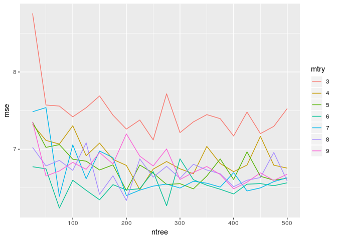

Homework 4: Bags, Forests, Boosts, oh my
================
Your Name Goes Here
2/28/2019

Problem 1
---------

Problem 7 from Chapter 8 in the text. To be specific, please use a sequence of `ntree` from 25 to 500 in steps of 25 and `mtry` from 3 to 9 for by 1.

In the lab, we applied random forests to the Boston data using mtry=6 and using ntree=25 and ntree=500. Create a plot displaying the test error resulting from random forests on this data set for a more comprehensive range of values for mtry and ntree. You can model your plot after Figure 8.10. Describe the results obtained.

Answer 1
--------

``` r
set.seed(1)
train <- sample(1:nrow(Boston), nrow(Boston) / 2)
Boston.train <- Boston[train, -14]
Boston.test <- Boston[-train, -14]
Y.train <- Boston[train, 14]
Y.test <- Boston[-train, 14]
rf.boston1 <- randomForest(Boston.train, y = Y.train, xtest = Boston.test, ytest = Y.test, mtry = ncol(Boston) - 1, ntree = 500)
rf.boston2 <- randomForest(Boston.train, y = Y.train, xtest = Boston.test, ytest = Y.test, mtry = (ncol(Boston) - 1) / 2, ntree = 500)
rf.boston3 <- randomForest(Boston.train, y = Y.train, xtest = Boston.test, ytest = Y.test, mtry = sqrt(ncol(Boston) - 1), ntree = 500)
plot(1:500, rf.boston1$test$mse, col = "green", type = "l", xlab = "Number of Trees", ylab = "Test MSE", ylim = c(10, 19))
lines(1:500, rf.boston2$test$mse, col = "red", type = "l")
lines(1:500, rf.boston3$test$mse, col = "blue", type = "l")
legend("topright", c("m = p", "m = p/2", "m = sqrt(p)"), col = c("green", "red", "blue"), cex = 1, lty = 1)
```

 \#\# Problem 2

Problem 8 from Chapter 8 in the text. Set your seed with 9823 and split into train/test using 50% of your data in each split. In addition to parts (a) - (e), do the following:

1.  Fit a gradient-boosted tree to the training data and report the estimated test MSE.
2.  Fit a multiple regression model to the training data and report the estimated test MSE
3.  Summarize your results.

Answer 2
--------

#### Part a

``` r
set.seed(9823)
train <- sample(1:nrow(Carseats), nrow(Carseats), nrow(Carseats)/2)
train_carseats <- Carseats[train, ]
test_carseats <- Carseats[-train, ]
```

#### Part b

``` r
#Regression Tree
carseats_tree <- tree(Sales ~ ., data = train_carseats)
summary(carseats_tree)
```

    ## 
    ## Regression tree:
    ## tree(formula = Sales ~ ., data = train_carseats)
    ## Variables actually used in tree construction:
    ## [1] "ShelveLoc"   "Price"       "Advertising" "Education"   "CompPrice"  
    ## [6] "Income"      "Age"        
    ## Number of terminal nodes:  17 
    ## Residual mean deviance:  2.085 = 798.7 / 383 
    ## Distribution of residuals:
    ##     Min.  1st Qu.   Median     Mean  3rd Qu.     Max. 
    ## -4.71900 -0.87300 -0.04756  0.00000  1.06300  4.46600

``` r
plot(carseats_tree)
text(carseats_tree, pretty = 0)
```


``` r
pred_carseats <- predict(carseats_tree, newdata = test_carseats)
test_sales <- Carseats[-train, "Sales"]
mean((pred_carseats-test_sales)^2)
```

    ## [1] 4.847714

``` r
#Gradient-Boosted Tree
train_carseats_gbm <- gbm(Sales ~ . ,data = train_carseats, distribution = "gaussian", n.trees = 5000, interaction.depth = 4)

summary(train_carseats_gbm)
```


    ##                     var     rel.inf
    ## Price             Price 33.79671693
    ## ShelveLoc     ShelveLoc 27.71478351
    ## CompPrice     CompPrice 14.24759051
    ## Advertising Advertising  9.51947825
    ## Age                 Age  8.52537403
    ## Income           Income  4.65886827
    ## Education     Education  0.64209756
    ## Population   Population  0.61322763
    ## US                   US  0.20694069
    ## Urban             Urban  0.07492263

``` r
par(mfrow = c(1,2))
plot(train_carseats_gbm, i = "Price")
plot(train_carseats_gbm, i = "ShelveLoc")
```


``` r
test_gbm_pred <- predict(train_carseats_gbm, newdata = test_carseats, n.trees = 5000)
mean((test_gbm_pred-test_sales)^2)
```

    ## [1] 1.973123

#### Part c

``` r
croVal_carseats <- cv.tree(carseats_tree)
plot(croVal_carseats$size, croVal_carseats$dev, type = "b")
```


``` r
tree_min <- which.min(croVal_carseats$dev)

carseat_prune <- prune.tree(carseats_tree, best = 5)
plot(carseat_prune)
text(carseat_prune,pretty = 0)
```


``` r
predict_carseats <- predict(carseats_tree, newdata = test_carseats)
plot(predict_carseats, test_sales)
abline(0, 1)
```


``` r
mean((predict_carseats-test_sales)^2)
```

    ## [1] 4.847714

#### Part d

``` r
carseats_bag <- randomForest(Sales ~ ., data = train_carseats, mtry = 10, ntree = 25, importance = TRUE)
predict_bag <- predict(carseats_bag, newdata = test_carseats)
mean((predict_bag-test_sales)^2)
```

    ## [1] 2.94035

``` r
importance(carseats_bag)
```

    ##               %IncMSE IncNodePurity
    ## CompPrice   16.640400     400.10747
    ## Income       8.153311     195.24054
    ## Advertising  7.525634     207.95905
    ## Population   5.120146     102.44513
    ## Price       29.604730     969.56245
    ## ShelveLoc   24.797480     764.53592
    ## Age          9.455128     231.86377
    ## Education    5.527918      98.26022
    ## Urban        1.673227      15.18031
    ## US           2.892191      17.42925

#### Part e

``` r
carseats_RF <- randomForest(Sales ~ ., data = train_carseats, mtry = 3, importance = TRUE)
predict_RF <- predict(carseats_RF, newdata = test_carseats)
mean((predict_RF - test_sales)^2)
```

    ## [1] 2.902399

``` r
importance(carseats_RF)
```

    ##              %IncMSE IncNodePurity
    ## CompPrice   39.27997     315.66425
    ## Income      32.35899     265.60815
    ## Advertising 34.21751     287.77546
    ## Population  23.57472     195.54156
    ## Price       55.23320     713.55049
    ## ShelveLoc   56.77474     619.49162
    ## Age         33.83493     296.66194
    ## Education   23.10962     144.22743
    ## Urban       10.29103      27.54734
    ## US          13.58499      39.39168
